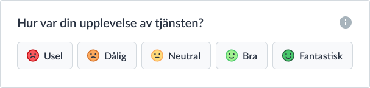

# UserFeedbackApp



## Table of Contents
- [UserFeedbackApp](#userfeedbackapp)
	- [Table of Contents](#table-of-contents)
	- [Introduction](#introduction)
	- [Features](#features)
	- [Installation](#installation)
	- [Usage](#usage)
		- [Running the App](#running-the-app)
		- [Storybook](#storybook)
	- [Deployment](#deployment)
	- [Contributing](#contributing)
	- [License](#license)

## Introduction

UserFeedbackApp is a small frontend application created using "Create React App." The main purpose of this app is to collect user feedback for functionality or features of third-party apps. It provides an easy-to-use interface for users to rate various aspects of the apps they interact with. See https://github.com/diggsweden/InclusionToolbox

The app is designed to be scalable, allowing it to handle a growing number of users and feedback efficiently. It also leverages Storybook for frontend reviews, making it easy for developers to review and test UI components in isolation.

## Features

- Allow users to rate functionality or features of third-party apps.
- Display an average rating for each aspect based on user inputs.
- Show visual representations of ratings (e.g., stars, emojis).
- Interactive and user-friendly interface.
- Scalable architecture to handle increasing user traffic and data.

## Installation

To run this project locally on your machine, follow these steps:

1. Ensure you have [Node.js 18](https://nodejs.org) or above installed on your system.
2. Clone this repository to your local machine using:
   ```
   git clone https://github.com/diggsweden/UserFeedbackApp.git
   ```
3. Navigate to the project directory:
   ```
   cd UserFeedbackApp
   ```
4. Install the required dependencies:
   ```
   npm install
   ```

## Usage

### Running the App

To start the development server and run the app locally, use the following command:

```
npm start
```

This will start the app on your local server, and you can access it in your web browser at `http://localhost:3000`.

### Storybook

Storybook is integrated into this project to help you review and test UI components in isolation. To launch Storybook, use the following command:

```
npm run storybook
```

This will start the Storybook server, and you can access it in your web browser at `http://localhost:6006`. You can view different UI components and interact with them in Storybook's intuitive interface.

## Deployment

This repository has been prepared for a CI/CD flow for AWS using Terraform (IoC). [terraform guidelines](https://developer.hashicorp.com/terraform/tutorials).
To deploy the app in a scalable manner, follow these steps:

Non-AWS:
1. Configure the necessary deployment settings based on your hosting provider.
2. Build the production-ready version of the app using:
   ```
   npm run build
   ```
3. Deploy the generated build files to your hosting platform.

Github CI/CD flow for AWS using terraform & github actions:
1. Make sure you have Terraform installed locally. [Installation guide](https://developer.hashicorp.com/terraform/tutorials/aws-get-started/install-cli)
2. Adjust the `terraform/variables.tf` file according to your environment.
3. Make sure you have a user named `github_user` with a set of 3rd-party keys.
4. Run `terraform plan` to review the changes being made
5. Run `terraform apply` to apply the resources
6. Add the secrets AWS_ACCESS_KEY_ID, AWS_SECRET_ACCESS_KEY & CLOUDFRONT_DISTRIBUTION_ID for your repository in github
7. Uncomment the "deploy" job in `.github/workflows/actions.yml`

Note: Run `terraform destroy` to remove the resources

## Contributing

Contributions to the UserFeedbackApp are welcome and encouraged! To contribute, follow these steps:

1. Fork the repository to your GitHub account.
2. Create a new branch based on the `main` branch for your changes:
   ```
   git checkout -b feature/your-feature-name
   ```
3. Make your desired changes and commit them with descriptive commit messages.
4. Push the changes to your forked repository.
5. Submit a pull request from your branch to the `main` branch of this repository.
6. Your pull request will be reviewed, and once approved, it will be merged.

Please ensure to follow the [Code of Conduct](CODE_OF_CONDUCT.md) when contributing.

## License

This project is licensed under the [MIT License](LICENSE). Feel free to use, modify, and distribute the code for personal or commercial projects.
